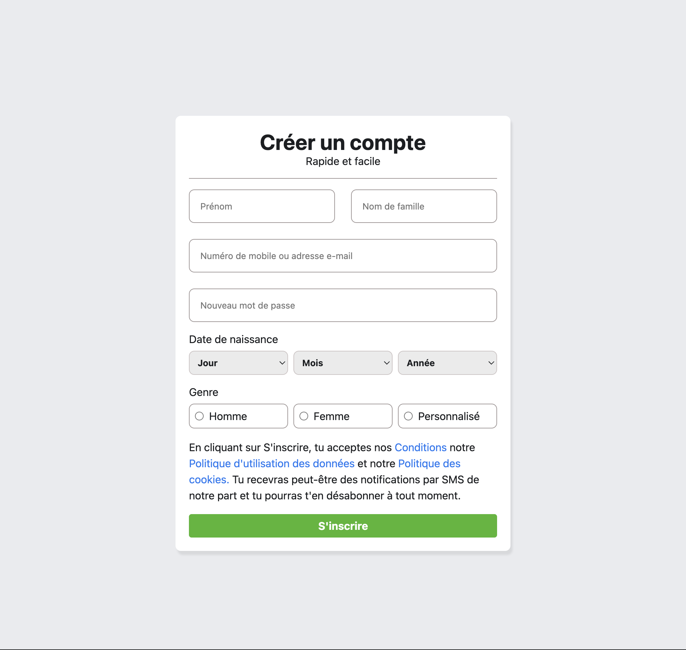
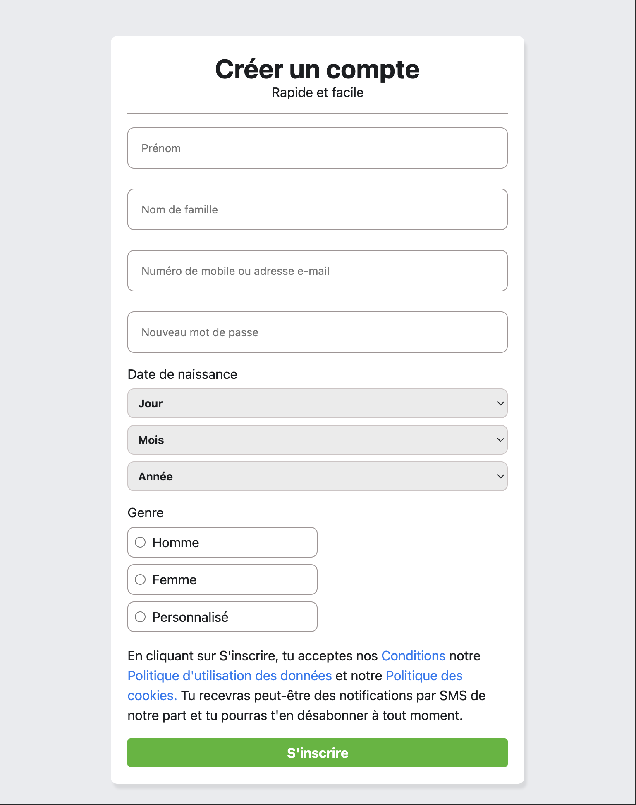
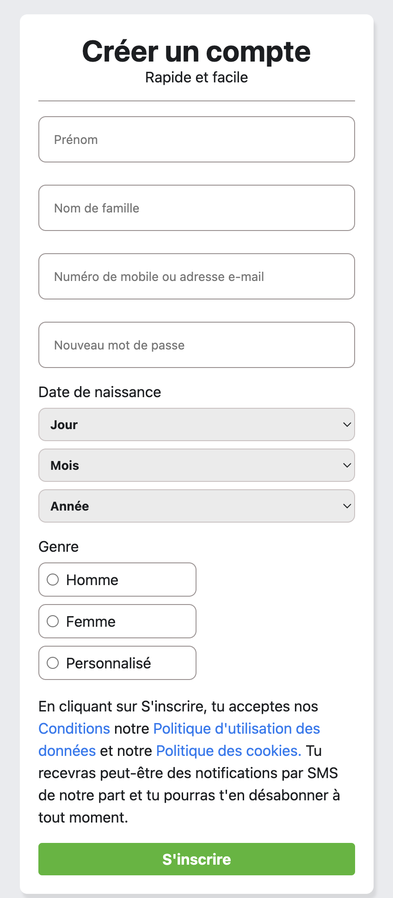

# Facebook Login Page

## Spécifications

Ce projet consiste à réaliser une page d'inscription inspirée de Facebook en utilisant uniquement HTML et CSS. L'objectif est de reproduire l'interface utilisateur de la page d'inscription de Facebook, en mettant l'accent sur la structure sémantique, l'accessibilité et le design responsive.

Structuration du formulaire d'inscription avec des champs pour le prénom, le nom, l'email ou le numéro de téléphone, le mot de passe, la date de naissance et le genre.
* Respect des bonnes pratiques d'accessibilité (labels, aria-labels, etc.).
* Utilisation de styles CSS pour obtenir une interface moderne et agréable à utiliser.
* Adaptation de la page pour différents supports (ordinateurs, tablettes, mobiles).
* Ajout d'informations légales et de liens vers les conditions d'utilisation, la politique de confidentialité et la politique de cookies.
* Ce projet permet de s'entraîner à l'intégration web et de se familiariser avec la création de formulaires complexes et accessibles.

## Structure HTML
Le tout tient dans un form divisé en header, section, footer.
* A m'intérieur du header se trouve le titre et le sous texte
* Dans section se trouve le corps du projet, plusieurs fieldset contenant les différents sous groupes de la section
* le footer contient les conditions d'ahdésion ainsi que le bouton de soumission

## Strucuture Css
A ce niveau, j'ai eu a utiliser les palettes de couleurs qui nous ont été donné. j'ai alterné, afin de faire un design fluide et responsive, entre flexbox et grid. J'ai aussi eu à faire des changements a partir de 768px pour que le design s'adapte aux différents écrans.

## Rendu

### 1024px
 

### 768px
 

### 425px

 

## Liens
### liens vers repo github:
[Github Repositorry](https://github.com/abbas001900/facebook-login-page.git)
### liens vers la github page:
[Github Page](https://abbas001900.github.io/facebook-login-page/)